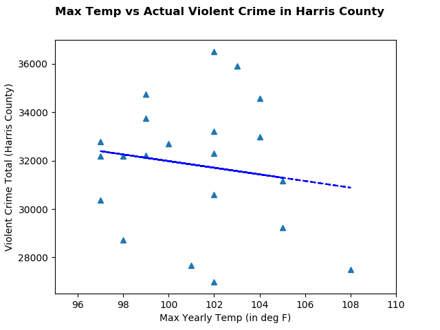
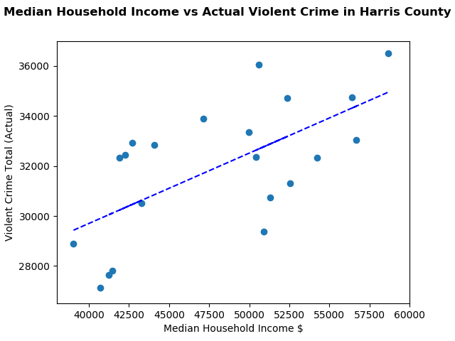

# Project 1: 
## Weather and Data

### Description
We are attempting to determine if there is a correlation between the peak temperatures and violent crime rate in Harris County. 
Crime data was taken from FBI.gov spanning 21 years from 2007 to 2017 for 90+ law enforcement agencies.  It was then compared to the average and peak yearly 
temperatures in the area for the same time period. 

A study simillar to this was also performed in much more nothern areas like Baltimore, MD which gave the inspiration for this study. 

### Issues:
Finding free data was hard.  We also originally wanted to be granular by collecting monthly data. While we were able to find very granular weather data (daily from 1964 to present), the crime data from the FBI was limited to yearly.  

Another problem we came 
across was that not all agencies reported accurate data.  Some didn't start reporting until 2010, others were missing years, others
didn't report at all. 

We compensated for this by writing the code in a way that tested for missing data and took the average of existing data to help 
fill in the gaps. 

### Conclusion
What we found is that there wasn't any correlation between weather and crime rate in Harris County. We think that it is due to 
the temperature being fairly constant, eventhough Harris County much more extreme high temperatures than Baltimore.  

We also did a test between crime rate and median household income and we found significance.  It appears that when the income 
goes up, so does the crime rate mostly aggrevated assault. 

